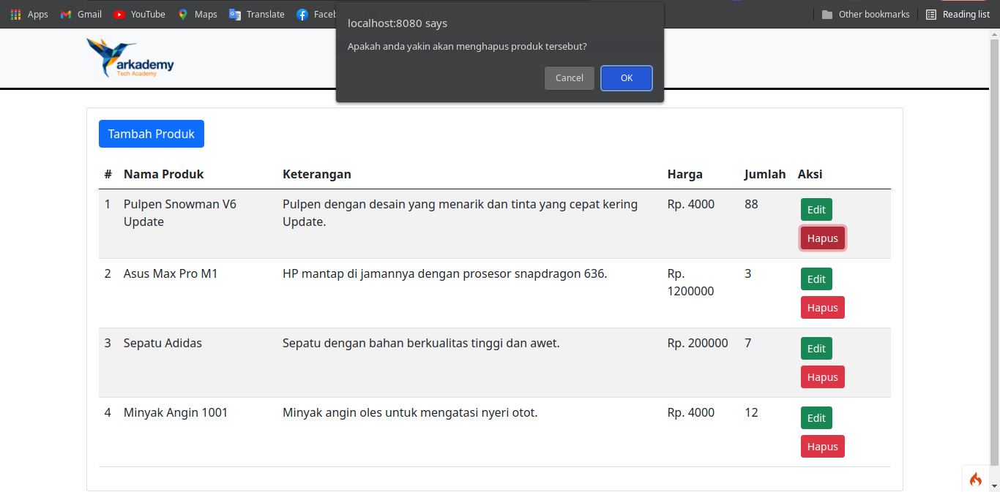

# Tes Seleksi Arkademy Level 3 - Tugas 10

## Cara menjalankan
- Clone repo ini.
- Jalankan `composer install`.
- Ubah file `env` menjadi `.env`.
- Buat database bernama arkademy lalu import file `arkademy.sql` yang telah disertakan.
- Jalankan server menggunakan `php spak serve`.

## All Screenshoot
### Home

### Add Produk

### Add Produk Success

### Edit Produk

### Edit Produk Success

### Delete Produk

### Delete Produk Success

